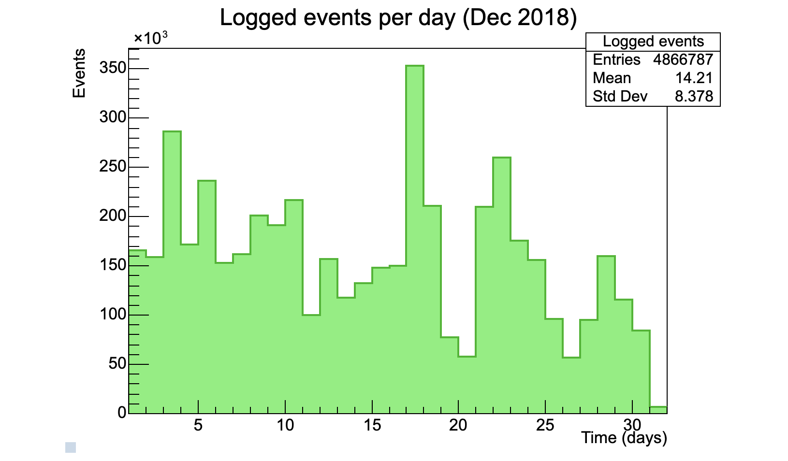
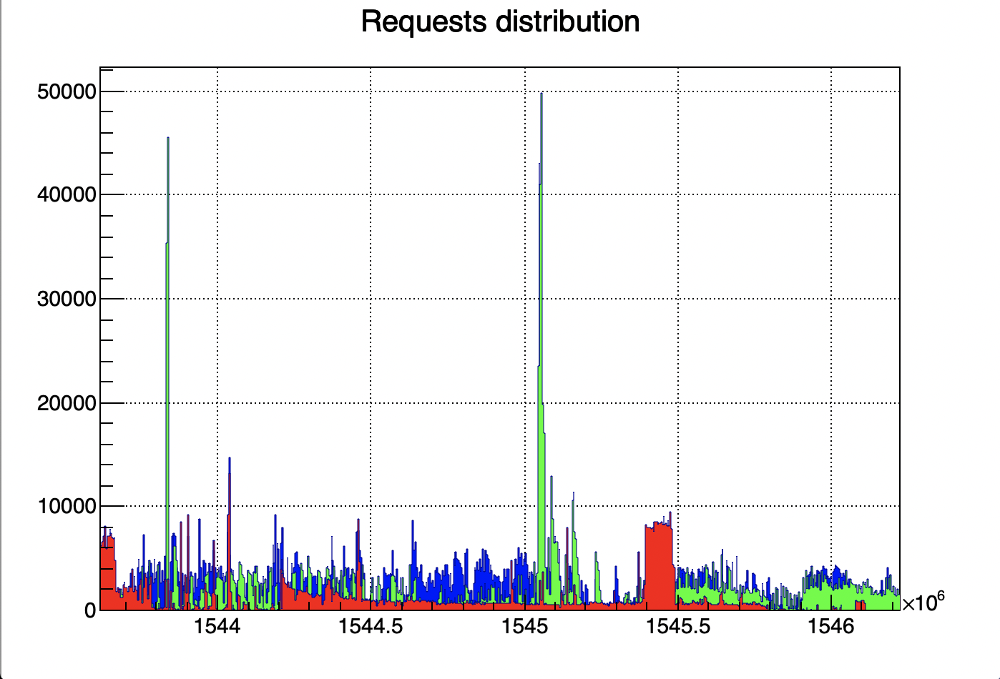

# What's this?
This is a piece of code that uses Python and CERN's PyROOT library to plot data on a graph. It was written during my
IT stage at CERN. The produced graphs are like these:

 plot1.py                      | plot2.py
:-----------------------------:|:-----------------------------:
   |  

###In particular:
- `plot1.py` plots the number of requests received each day
- `plot2.py` plots the type of requests received by timestamp
- `plot3.py` plots the type of requests received by experiment

---

# How to use:
1. Install [Python 2.7](https://www.python.org/downloads/release/python-272/) on your machine
1. Install ROOT library from [CERN's official website](https://root.cern.ch/downloading-root)
1. Get some data. I couldn't upload the whole dataset i used to make the graphs (400MB), but you
can use `sample.json` and `sample-parsed.json` to get an idea.
1. Open a Python console and run the program
    ```
    python
    execfile("plot[1|2|3].py")
    ```
1. If you want to make changes to the graph, re-run
    `execfile("plot[1|2|3].py")`  
    without closing the Python console (it will be faster, since you won't have to re-read the whole dataset)

 